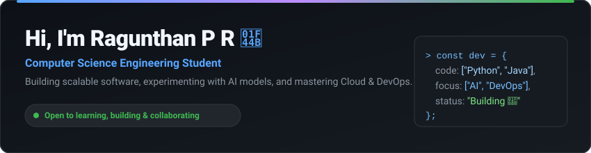
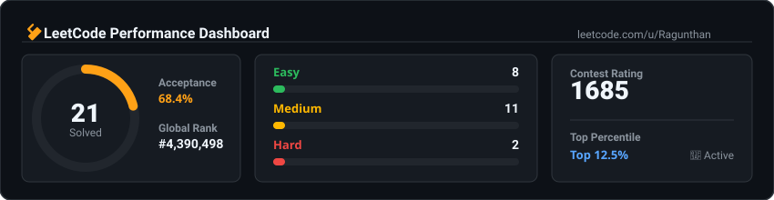

<!-- 
================================================================================
RAGUNTHAN P R — DEVELOPER PORTFOLIO README
================================================================================
-->

  <!-- SECTION 1: HERO BANNER -->
  

    

  <!-- HERO NAVIGATION BUTTONS -->
  
  &nbsp;
  
  &nbsp;
  
  &nbsp;
  

 

<!-- SECTION 2: QUICK PROFILE STRIP -->
<table width="100%" border="0" cellspacing="0" cellpadding="0">
  <tr>
    <td width="16.6%" align="center" bgcolor="#161b22" style="padding: 12px; border: 1px solid #30363d; border-radius: 8px;">
      <b>🎓 Computer Science</b> 
      Engineering Student
    </td>
    <td width="16.6%" align="center" bgcolor="#161b22" style="padding: 12px; border: 1px solid #30363d; border-radius: 8px;">
      <b>💻 Software Dev</b> 
      Full-Stack Apps
    </td>
    <td width="16.6%" align="center" bgcolor="#161b22" style="padding: 12px; border: 1px solid #30363d; border-radius: 8px;">
      <b>🤖 Artificial Intelligence</b> 
      AI & ML Models
    </td>
    <td width="16.6%" align="center" bgcolor="#161b22" style="padding: 12px; border: 1px solid #30363d; border-radius: 8px;">
      <b>☁️ Cloud & DevOps</b> 
      AWS & Docker
    </td>
    <td width="16.6%" align="center" bgcolor="#161b22" style="padding: 12px; border: 1px solid #30363d; border-radius: 8px;">
      <b>🔐 Cyber Security</b> 
      SecOps & Systems
    </td>
    <td width="16.6%" align="center" bgcolor="#161b22" style="padding: 12px; border: 1px solid #30363d; border-radius: 8px;">
      <b>🚀 Real-World Projects</b> 
      Practical Solutions
    </td>
  </tr>
</table>

 

<!-- SECTION 3: LEETCODE -->
## 🧩 LeetCode

  

 

<table width="100%" border="0" cellspacing="0" cellpadding="0">
  <tr bgcolor="#161b22">
    <td align="center" width="20%" style="padding: 10px; border: 1px solid #30363d;">
      Problems Solved 
      <b>21</b>
    </td>
    <td align="center" width="15%" style="padding: 10px; border: 1px solid #30363d;">
      Easy 
      <b>8</b>
    </td>
    <td align="center" width="15%" style="padding: 10px; border: 1px solid #30363d;">
      Medium 
      <b>11</b>
    </td>
    <td align="center" width="15%" style="padding: 10px; border: 1px solid #30363d;">
      Hard 
      <b>2</b>
    </td>
    <td align="center" width="17.5%" style="padding: 10px; border: 1px solid #30363d;">
      Acceptance 
      <b>68.4%</b>
    </td>
    <td align="center" width="17.5%" style="padding: 10px; border: 1px solid #30363d;">
      Contest Status 
      <b>Active</b>
    </td>
  </tr>
</table>

  <a href="https://leetcode.com/u/Ragunthan/">
    <b>LeetCode Profile →</b>
  </a>

 

<!-- SECTION 4: TECH STACK (MERGED TEXT & ICONS) -->
## ⚡ Tech Stack

<table width="100%" border="0" cellspacing="0" cellpadding="0">
  <tr>
    <td width="22%" bgcolor="#161b22" style="padding: 14px; border: 1px solid #30363d;">
      <b>Languages</b>
    </td>
    <td width="78%" bgcolor="#0d1117" style="padding: 14px; border: 1px solid #30363d;">
      
    </td>
  </tr>
  <tr>
    <td bgcolor="#161b22" style="padding: 14px; border: 1px solid #30363d;">
      <b>Frontend</b>
    </td>
    <td bgcolor="#0d1117" style="padding: 14px; border: 1px solid #30363d;">
      
    </td>
  </tr>
  <tr>
    <td bgcolor="#161b22" style="padding: 14px; border: 1px solid #30363d;">
      <b>Backend &amp; Database</b>
    </td>
    <td bgcolor="#0d1117" style="padding: 14px; border: 1px solid #30363d;">
      
    </td>
  </tr>
  <tr>
    <td bgcolor="#161b22" style="padding: 14px; border: 1px solid #30363d;">
      <b>DevOps &amp; Cloud</b>
    </td>
    <td bgcolor="#0d1117" style="padding: 14px; border: 1px solid #30363d;">
      
    </td>
  </tr>
  <tr>
    <td bgcolor="#161b22" style="padding: 14px; border: 1px solid #30363d;">
      <b>Development Tools</b>
    </td>
    <td bgcolor="#0d1117" style="padding: 14px; border: 1px solid #30363d;">
      
    </td>
  </tr>
</table>

 

<!-- SECTION 5: FEATURED PROJECTS -->
## 🚀 Featured Projects

<table width="100%" border="0" cellspacing="0" cellpadding="0">
  <tr>
    <!-- Project 1 -->
    <td width="33.3%" valign="top" bgcolor="#161b22" style="padding: 16px; border: 1px solid #30363d; border-radius: 8px;">
      <h3>🚌 Dynamic QR Bus System</h3>
      
A smart transportation platform using QR technology, real-time bus information, AI-based predictions and passenger safety features.

      

        
        
        
        
        
      

      

      
      &nbsp;
      
    </td>

    <!-- Project 2 -->
    <td width="33.3%" valign="top" bgcolor="#161b22" style="padding: 16px; border: 1px solid #30363d; border-radius: 8px;">
      <h3>☁️ Cloud DevOps CI/CD Pipeline</h3>
      
Automated application build, testing, containerization and deployment using modern DevOps technologies.

      

        
        
        
        
        
      

      

      
      &nbsp;
      
    </td>

    <!-- Project 3 -->
    <td width="33.3%" valign="top" bgcolor="#161b22" style="padding: 16px; border: 1px solid #30363d; border-radius: 8px;">
      <h3>✨ [Your Next Project]</h3>
      
Upcoming high-impact software project exploring AI agents, distributed cloud architecture, or intelligent systems.

      

        
        
        
      

      

      
      &nbsp;
      
    </td>
  </tr>
</table>

 

<!-- SECTION 6: PORTFOLIO CALLOUT -->
## 🌐 Portfolio

<table width="100%" border="0" cellspacing="0" cellpadding="0">
  <tr bgcolor="#161b22">
    <td align="center" style="padding: 24px; border: 1px solid #30363d; border-radius: 10px;">
      <b>Want to know more about what I build?</b> 
      Explore live demos, detailed case studies, and engineering projects on my personal portfolio website.
        
      
    </td>
  </tr>
</table>

 

<!-- SECTION 7: WHAT I DO -->
## 💡 What I Do

<table width="100%" border="0" cellspacing="0" cellpadding="0">
  <tr>
    <td width="50%" valign="top" bgcolor="#161b22" style="padding: 16px; border: 1px solid #30363d;">
      <h4>💻 Software Development</h4>
      
Building practical, efficient applications and solving real-world programming problems with clean architecture.

    </td>
    <td width="50%" valign="top" bgcolor="#161b22" style="padding: 16px; border: 1px solid #30363d;">
      <h4>🤖 AI &amp; Machine Learning</h4>
      
Exploring intelligent applications, computer vision, natural language processing, and automated workflows.

    </td>
  </tr>
  <tr>
    <td width="50%" valign="top" bgcolor="#161b22" style="padding: 16px; border: 1px solid #30363d;">
      <h4>☁️ Cloud &amp; DevOps</h4>
      
Learning scalable infrastructure, container management, automated testing pipelines, and cloud deployments.

    </td>
    <td width="50%" valign="top" bgcolor="#161b22" style="padding: 16px; border: 1px solid #30363d;">
      <h4>🧩 Problem Solving</h4>
      
Practicing data structures and algorithms daily through competitive programming on LeetCode.

    </td>
  </tr>
</table>

 

<!-- SECTION 8: FOOTER -->

  
<i>"Build. Learn. Solve. Repeat."</i>

  
© 2026 Ragunthan P R

