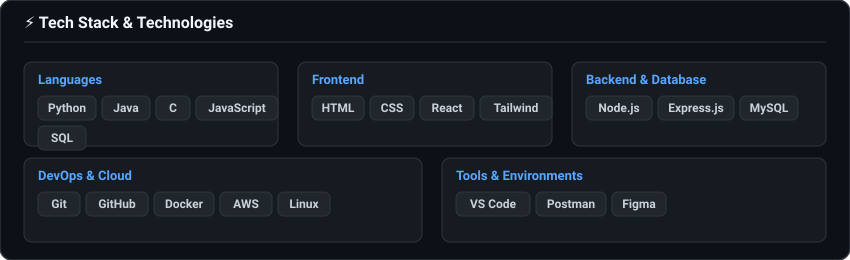

<div align="center">

```bash
ragunthan@github:~$ ./contributions.sh
```

<!-- GitHub Contribution Heatmap SVG -->
<a href="https://github.com/ragunthan-source">
  
</a>

<br />
<br />

```bash
ragunthan@github:~$ whoami
```

<!-- Side-by-Side Tech Stack & Neofetch Information Card -->
<table border="0" cellpadding="0" cellspacing="0">
  <tr>
    <td align="center" valign="top" width="50%">
      
    </td>
    <td align="center" valign="top" width="50%">
      
    </td>
  </tr>
</table>

<br />

```bash
ragunthan@github:~$ ./status.sh --continuous-integration
```

> **Automated Profile**: Heatmap stats, Technical Skills card, and Neofetch card are automatically updated daily via GitHub Actions.

---

```bash
ragunthan@github:~$ exit
```

</div>
